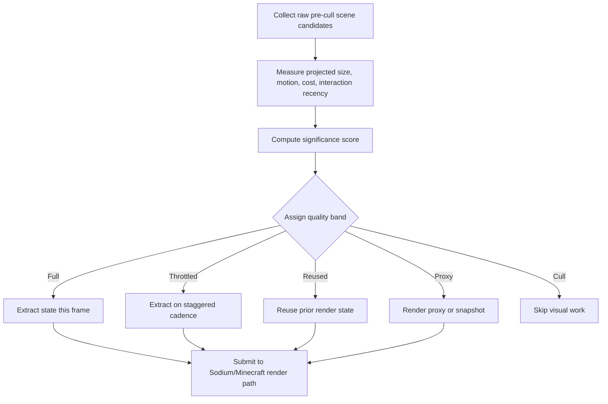
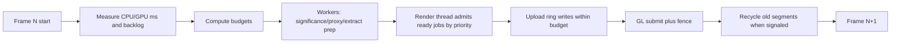

# A Practical Sodium-Companion Architecture for Heavy-Mod Minecraft

## Executive summary

The most promising, distinctive system for **heavily modded Minecraft** is not a new renderer. It is a **significance-driven visual virtualization layer** that sits *before* Sodium and decides **which expensive client-side visual work deserves full fidelity this frame, which work can be temporally reused, and which work can be represented by cheaper proxies**. That approach is common in large engines—Unreal’s **Significance Manager**, **Animation Budget Allocator**, and **HLOD** all formalize “importance-driven quality” and “fixed-time budgets”—but it is still uncommon in Minecraft mod optimization, which is dominated by renderer rewrites, simple culling, and static distance limits. Unreal explicitly uses significance values to decide LOD, tick frequency, effect spawning, and other behavior; its animation budgeter constrains work to a fixed millisecond budget and reduces tick rate or interpolation quality when needed. Those are the right inspirations for a Sodium companion in modded Minecraft. citeturn12view0turn14view3turn11view2

The top recommendation is therefore a client-only system I will call **Temporal Significance Virtualization**. It assigns every expensive visual object—block entities, contraptions, animated entities, particles, modded displays, pipes, cables, machine faces—a continuously updated **significance score** based on raw pre-cull scene density, projected screen size, motion, interaction recency, and measured cost. That score drives **visual update rate**, **render-state reuse**, **proxy/impostor substitution**, and **cluster batching**. The novelty is not any single technique in isolation; it is the **combination** of significance scoring, temporal reuse, and progressive proxy refinement in a way that preserves compatibility with Sodium instead of replacing it. Unreal’s Significance Manager and budget allocator provide the closest production precedent, and Fabric/NeoForge’s block-entity rendering hooks make this practical in Minecraft because block entities already expose dedicated rendering paths and, on modern Fabric docs, a render-state extraction model. citeturn12view0turn14view0turn13view2turn11view6

The second recommendation is an **Adaptive Work Governor** that unifies **chunk rebuild pacing, upload pacing, block-entity proxy refreshes, and expensive visual extraction tasks** under a frame-time budget. Again, the inspiration comes from established engine practice: Unreal budgets work in milliseconds, Unity and Intel document work-stealing task systems for balancing CPU jobs, and Khronos documents persistent mapped streaming and sync objects for avoiding CPU/GPU upload stalls. In Minecraft terms, this means spreading work across frames, protecting 1% lows, using worker threads only for CPU-safe preparation, and keeping actual OpenGL submission on the render thread. This is especially important on high-end desktops where terrain rendering is already fast but **render-thread overhead, upload bursts, and micro-stutter** still matter. citeturn11view10turn12view6turn11view4turn11view5turn13view0

A constraint matters: if you do **not** change server-side game logic, you should be honest about what “TPS gains” mean. For a remote dedicated server, these features will mostly improve **client FPS and frame pacing**, not the server’s simulation rate. For **singleplayer and integrated hosting**, however, Minecraft runs a logical server on the same machine; NeoForge explicitly documents that the physical client spins up a logical server locally and connects to it conceptually like localhost. In that case, lowering client render-thread contention, allocation pressure, and GPU/CPU synchronization can improve **integrated-server MSPT stability** indirectly. Optional server-side *hinting* can also help clients adapt earlier in dense areas without changing gameplay logic, but that is a lower-priority extension, not the core prototype. citeturn11view14turn11view3turn11view13

The result is a practical roadmap: **first build the significance/temporal-reuse layer, then build the adaptive work/upload governor, then add optional cluster proxies and server hinting, and only then consider experimental GPU-assisted proxy batching**. That ordering maximizes impact, minimizes Sodium-compatibility risk, and directly targets the metrics you care about most: **worst-frame spikes, 1% lows, and bad dense-scene behavior**. Sodium already “renders Minecraft better”; the most useful companion mod is one that **makes Minecraft ask Sodium to render less work, and to schedule that work more intelligently**. Sodium itself positions as a rendering engine optimization focused on frame rates and micro-stutter, which makes that companion role a clean fit rather than direct competition. citeturn11view8turn12view0turn14view3

## Constraints and performance model

Heavy modpacks stress the client in ways that vanilla-focused optimization often does not. NeoForge’s own documentation describes block entities as being used not just for storage, but also for **tick-based tasks** and **dynamic rendering**, with examples including **quarries, sorting machines, pipes, and displays**—exactly the kinds of objects that dominate bases built around Create, Mekanism, AE2, Refined Storage, or Immersive Engineering. NeoForge also documents that block entities can tick every game tick and that block-entity renderers are called every frame. That combination—high object count, high visual dynamism, and per-frame rendering hooks—is why modded bases become pathological scenes. citeturn7search14turn11view7turn11view6

Fabric’s current documentation makes the opportunity even clearer. Its block-entity renderer documentation explicitly describes a **submit/render** path and a **render-state extraction** step, where data is gathered into a separate render state that the renderer later uses. That pattern is valuable because it creates a natural seam for **temporal reuse**: if the visual state has not changed enough to justify re-extracting or re-uploading, a client-side optimizer can legally keep using a cached state for one or more frames. This is exactly the kind of seam that large engines exploit when they lower tick rates, interpolate between updates, or swap to proxy representations under budget pressure. citeturn13view2turn13view3turn14view3

This also explains why the recommended solution should be a **Sodium companion**, not a replacement. Sodium is explicitly a “high-performance rendering engine replacement” focused on raising frame rates and reducing micro-stutter. Replacing it or competing with its terrain pipeline would multiply compatibility risk. A companion mod should instead focus on **pre-render workload shaping**: deciding what visual objects get full-rate updates, pacing uploads, pacing rebuilds, and creating cheaper proxy representations for far or low-significance modded content. That aligns with the architectural boundary between “what work exists” and “how work is rendered.” citeturn11view8

The last piece of the performance model is hardware target. On lower-end GPUs and iGPUs, reducing the number of expensive visuals, particles, and uploads will usually improve both average FPS and worst-frame GPU time. On high-end GPUs, the larger win often shifts to **CPU-side pacing**: fewer draw-call bursts, fewer uploads that stall the driver, fewer per-frame block-entity extractions, and fewer long frames caused by rebuild storms. Khronos’ documentation around streaming buffers, persistent mappings, sync objects, and multi-draw exists precisely because CPU/driver overhead becomes a dominant cost when raw GPU rasterization is not the bottleneck. citeturn11view4turn11view5turn13view0turn11view11

## Ranked roadmap

The following roadmap is ordered by **practicality first**, then by likely benefit to **1% lows and worst-frame spikes**, and only secondarily by average FPS.

| Rank | Feature | Why it matters | Expected impact | Difficulty | Sodium-compat risk | Safety | Basis |
|---|---|---|---|---|---|---|---|
| 1 | **Temporal Significance Virtualization** | Budgets block entities, contraptions, particles, and expensive entities by importance; enables rate throttling, state reuse, and proxying before work reaches Sodium | Very high for dense modded bases; especially strong for 1% lows and worst frames | Medium | Low | High | Unreal Significance Manager, Animation Budget Allocator, URO, Fabric render-state extraction, NeoForge BER/ticker model. citeturn12view0turn14view3turn14view4turn13view2turn11view6turn11view7 |
| 2 | **Adaptive Work Governor with upload/rebuild pacing** | Converts bursts into bounded budgets; spreads rebuilds, uploads, and proxy refreshes across frames; reduces stalls | Very high for worst-frame spikes on all hardware | Medium | Low to medium | High | Unreal fixed-ms budgeting, Unity/Intel work-stealing, Khronos buffer streaming, persistent mapping, fence sync. citeturn14view3turn11view10turn12view6turn11view4turn11view5turn13view0 |
| 3 | **Cluster proxies and impostor snapshots** | Replaces far machine rooms and repeated modded detail with cheaper proxies or snapshots | High in megabases; moderate elsewhere | Medium to high | Medium | Medium | Unreal HLOD, billboard-cloud and multi-mesh impostor literature. citeturn11view2turn12view8turn11view12 |
| 4 | **Optional server hint channel** | Lets clients pre-adapt when entering dense hubs or machine areas without changing gameplay logic | Medium; strongest in multiplayer hubs and modded SMP bases | Medium | Low | High | Unreal Replication Graph and MMO interest-management research show the value of relevance metadata and persistent per-client lists. citeturn11view3turn11view13 |
| 5 | **Experimental GPU-assisted proxy culling/batching** | Useful for Optiminium-owned proxy batches, not for replacing Sodium’s world renderer | Medium long-term, low short-term | High | High | Medium | GPU-driven rendering and multi-draw indirect reduce CPU overhead, but require more control over draw generation than a safe Sodium companion should assume. citeturn12view12turn11view11turn9search2 |

The key recommendation is to **prototype the first two together conceptually, but implement them in sequence**. The reason is that the significance system supplies the **what** and the work governor supplies the **when**. If you implement only pacing without a significance model, you still spend time on the wrong things. If you implement only significance without pacing, you can still spike when too many “important” objects refresh at once. Unreal’s budgeted animation systems already show that importance scoring plus fixed budgets is the winning combination in large-object scenes, and the same logic transfers well to Minecraft’s block-entity-heavy modpacks. citeturn14view3turn14view0

## Latest benchmark read

The latest benchmark still supports the companion-layer strategy, but it changes the immediate priority. Optiminium ON improved average FPS from 41.0 to 42.5, 1% low from 24.5 to 26.0, and worst-frame FPS from 24.3 to 25.2. Worst GPU time improved from 28.78 ms to 25.55 ms, while average GPU time slightly regressed from 18.54 ms to 18.74 ms. That means the current culling path is helping the long tail more than the average frame, which is exactly where the report expects a workload-shaping layer to matter most.

The active contributors in this run are existing culling systems: 46,161 hidden particles, 175,929 culled block entities, and 4,636 culled entities. Adaptive quality did not participate: `rawSpikeTriggerFrames`, `pacingSpikeTriggerFrames`, all cooldown counters, and both minimum quality scales stayed at zero or 1.00. Upload work was present in ON mode at 7.0 uploads/frame with a small 0.38 ms average/worst upload time, so upload pacing is not the first bottleneck in this sample.

The immediate blocker for Temporal Significance Virtualization is metric confidence. OFF reported `maxVisibleBlockEntities=0` and `denseSceneFrames=0`, while ON reported `maxVisibleBlockEntities=412` and `denseSceneFrames=0`. Since ON also culled 175,929 block entities, the scene clearly contains block-entity pressure, but the benchmark line does not yet expose consistent raw pre-cull scene complexity. Before enabling any temporal throttling or proxy behavior, the next benchmark must report `rawVisibleBlockEntities`, `renderedBlockEntitiesAfterCulling`, `culledBlockEntitiesThisRun`, and `significanceBands` for both OFF and ON.

Therefore the implementation order is:

1. Finish benchmark metric correctness for raw visible block entities and significance bands.
2. Re-run the same scene and verify OFF/ON use the same raw density source.
3. Only after raw metrics are trustworthy, use significance bands to decide throttled/reused/proxy candidates.
4. Keep Adaptive Work Governor changes secondary until upload/rebuild/backlog metrics show pressure.

## Prototype design for Temporal Significance Virtualization

### Concept

This prototype turns expensive visuals into **budgeted citizens** instead of treating every visible object as entitled to full-rate updates. The nearest production analog is Unreal’s Significance Manager, which computes an object significance value and uses that to decide things like LOD, tick frequency, and effect spawning. Unreal’s animation systems then go further by explicitly fitting updates into a **fixed millisecond budget**, reducing tick rates and optionally interpolating when necessary. The proposed Minecraft system applies the same logic to **block entities, contraptions, animated entity renderers, and particle-heavy effects**, using Minecraft’s rendering seams rather than replacing the renderer underneath. citeturn12view0turn14view3turn14view1

The key departure from common Minecraft practice is **temporal reuse**. Rather than “render fully or cull,” the system introduces intermediate states: **full-rate render**, **reduced update-rate render**, **cached render-state reuse**, **proxy or impostor render**, and finally **culled**. This is much closer to Unreal’s **URO/Anim Budgeter** and to graphics literature on **impostors and progressive refinement** than to simple frustum culling. Multi-mesh impostors are especially relevant because the paper explicitly argues for combining pre-generated and dynamically updated impostors and allowing a **gradual transition** to more expensive updates only when frame-time allows. citeturn14view4turn11view12

### Data model

The system should operate on a generic `VisualNode`, not on hardcoded mod names. That keeps it compatible with unknown mods and lets you evolve from generic heuristics to optional adapters later.

```text
VisualNodeKey
- world identity
- type: block_entity | entity | particle_group | contraption_proxy
- stable id: BlockPos / entity id / synthetic cluster id
- renderer class name
- section/chunk coordinates

VisualNodeState
- rawVisibleThisFrame
- projectedAreaPx
- distanceSq
- screenCenterWeight
- viewDot
- motionScore
- interactionRecencyFrames
- stateHash
- classCostEwmaMs
- lastExtractFrame
- lastRenderFrame
- lastProxyRefreshFrame
- occlusionConfidence
- significanceScore
- qualityBand

RendererClassProfile
- renderer class name
- avgExtractCpuMs
- avgSubmitCpuMs
- avgProxyBuildMs
- volatility score
- supportsStateReuse
- supportsTransformInterpolation
- proxySafe
- translucentOrShaderSensitive
```

The system should additionally keep a **raw scene record** per frame, computed *before* Optiminium’s own culling decisions, because adaptive budgets should respond to **true scene pressure**, not to already-reduced post-cull counts. Unity’s CullingGroup API is conceptually useful here because it separates managed visibility/distance state from the logic that consumes it; Unreal’s significance framework likewise updates objects from a central manager rather than from ad hoc per-object decisions. citeturn12view4turn11view9turn12view0

### Heuristics and generic adapters

A mod-aware system does not have to mean a mod-hardcoded system. The safest generic approach is to build **runtime class profiles** and infer expensive behavior from patterns:

1. **Count and cost**: classes that appear in high counts and accumulate high average extract/submit time are strong optimization targets.
2. **Volatility**: if a renderer’s state hash barely changes across many frames, it is a good candidate for reuse or reduced update rate.
3. **Interaction sensitivity**: recently looked-at, interacted-with, recently changed, or center-of-screen visuals get quality protection.
4. **Representation stability**: renderers that mostly transform or tint a stable model are more proxy-safe than ones that procedurally rebuild complex translucent geometry.
5. **Shader sensitivity**: renderer classes that rely heavily on transparency, multipass effects, or shader pack interactions should default to **rate throttling only**, not proxy substitution.

NeoForge’s BER API and Fabric’s block-entity rendering docs both support the premise that modded visuals are channeled through dedicated renderer classes. Fabric’s explicit render-state extraction model makes class-level profiling particularly attractive because state extraction and drawing are already conceptually separated. citeturn11view6turn13view2turn13view3

### Quality bands

The most practical first version is a five-band model:

| Band | Policy | Typical use |
|---|---|---|
| Full | Extract and render every frame | Nearby, looked-at, interacted-with, high-motion visuals |
| Throttled | Extract every 2 frames, render every frame using interpolation or reused state | Mid-distance animated machinery |
| Reused | Extract every 4–8 frames, reuse render state between extractions | Far stable block entities and contraption pieces |
| Proxy | Render simplified mesh/snapshot/impostor, refresh occasionally | Distant machine rooms, cable blocks, decorative displays |
| Culled | Hidden for this frame | Offscreen or negligible-significance visuals |

This structure is strongly supported by Unreal’s animation budgeter, which explicitly reduces update rate, can stop ticking components, and can choose whether to interpolate between updates; Unreal’s URO docs even recommend very low update rates at distance in many cases. For distant modded visuals, that is exactly the right mental model. citeturn14view1turn14view4

### Scoring algorithm

A practical significance formula should mix **visibility, attention, dynamism, and measured cost**:

```text
score =
  w_area      * log2(projectedAreaPx + 1)
+ w_center    * screenCenterWeight
+ w_motion    * motionScore
+ w_recent    * interactionRecencyBoost
+ w_cost      * classCostEwmaMs
+ w_active    * activityFlag
- w_distance  * distanceBandPenalty
- w_occluded  * occlusionConfidence
```

Where:

- `projectedAreaPx` is derived from AABB projection.
- `interactionRecencyBoost` decays over several seconds after the player looks at or interacts with the object.
- `activityFlag` can reflect local evidence like animation state changes, particle emission, or frequent state-hash updates.
- `occlusionConfidence` is optional at first and can be a simple temporal heuristic rather than a full occlusion query system.

An optional later extension is to use **last-frame visibility history** or conservative occlusion hints. NVIDIA’s practical occlusion-query guidance emphasizes that occlusion helps most when large groups of objects can be skipped together, which argues for *cluster-level* use rather than per-object micromanagement. That fits modded bases well: treat a whole cable room or machine bank as a cluster before considering proxying. citeturn12view11

### Scheduling algorithm

The significance system should not refresh every object independently. It should operate through **frame buckets**:

```text
for each frame:
    rawCandidates = gatherRawVisibleCandidates(preCull=true)

    for node in rawCandidates:
        updateNodeMetrics(node)
        node.significance = computeScore(node)

    sort nodes by significance descending

    budgets = {
        fullExtractMs,
        throttledExtractMs,
        proxyRefreshMs,
        particleMs
    }

    for node in nodes:
        band = chooseBand(node, budgets, framePressure)

        if band == Full:
            scheduleExtract(node, thisFrame)
            scheduleRender(node, full)
        else if band == Throttled:
            if frameIndex % 2 == node.phase:
                scheduleExtract(node, thisFrame)
            scheduleRender(node, interpolateOrReuse)
        else if band == Reused:
            if refreshDue(node):
                scheduleExtract(node, thisFrame)
            scheduleRender(node, reuseState)
        else if band == Proxy:
            if proxyRefreshDue(node):
                scheduleProxyRefresh(node)
            scheduleRender(node, proxy)
        else:
            skip(node)
```

The critical implementation detail is **phase staggering**. Each node gets a deterministic phase so that “every 4 frames” does not become “all at once every 4th frame.” That temporal staggering is one of the main reasons this prototype should improve **1% lows** instead of just average FPS. Unreal’s budgeted systems exist for exactly this reason: spreading quality degradation and update reductions in a controlled way instead of letting spikes appear randomly. citeturn14view3turn14view0

### Mermaid flowchart



### Metrics to collect

The system is only as good as its instrumentation. At minimum, collect:

- `rawVisibleBlockEntities`
- `rawVisibleAnimatedEntities`
- `rawVisibleParticleGroups`
- `significanceBandCounts[band]`
- `stateExtractionsThisFrame`
- `reusedStateRendersThisFrame`
- `proxyRendersThisFrame`
- `proxyRefreshesThisFrame`
- `staleProxyFrames`
- `hiddenByBudget`
- `blockEntityExtractCpuMs`
- `entityVisualCpuMs`
- `particleBudgetCpuMs`
- `qualityEscalations`
- `qualityDemotions`

Fabric’s render-state model and NeoForge’s explicit BER/ticker structure make these measurements feasible and semantically meaningful. citeturn13view2turn11view6turn11view7

### Expected benefits

This prototype should improve **average FPS on low-end hardware**, but its more important contribution is to **make dense modded scenes age gracefully**. On laptops and iGPUs, it reduces the raw amount of expensive visual work and should lower both CPU and GPU cost. On high-end desktops, its bigger value is cutting the long-tail of bad frames by preventing synchronized bursts of block-entity state extraction, particle submission, and proxy refreshes. In singleplayer or integrated hosting, lowering local render overhead can also improve the stability of the local logical server because both client and server run on the same machine. citeturn11view14turn14view3turn11view5

### Failure modes and compatibility notes

The obvious failure mode is **staleness**: a machine that visibly changes state but is stuck in a slow refresh band can look wrong. The mitigation is to over-weight **interaction recency**, **screen-center bias**, **visual state-hash changes**, and optionally **audio/particle emission** as escalation triggers. The second failure mode is **proxy incompatibility** with shader packs or translucent renderers. That should be handled conservatively: when Iris/Oculus or unknown shader-sensitive renderer classes are detected, the system should remain in **rate-throttling/reuse mode only**. The third failure mode is **phase aliasing**, where too many objects share the same refresh frame; the fix is deterministic spreading by object hash. These are normal concerns in significance-driven systems, which is why Unreal’s own documentation emphasizes explicit control over tick rate, significance, and interpolation behavior. citeturn14view0turn14view1turn14view4

## Prototype design for the Adaptive Work Governor

### Concept

The second prototype addresses a different problem: even if you know *what* deserves work, Minecraft can still produce ugly frames if it performs too much heavy work in the same frame. This is the logic behind Unreal’s fixed-budget animation allocator and also behind modern GL/Vulkan streaming advice: put aggressive systems under a **bounded budget**, then smooth or defer work when pressure rises. In Minecraft, the work categories are **chunk rebuilds, mesh uploads, block-entity proxy refreshes, render-state extraction, and particle/effect bursts**. The governor should not replace Sodium’s mesher or renderer; it should **shape and pace the work that reaches them**. citeturn14view3turn11view4turn11view5

The work governor should also be **cooperative and thread-aware**. Unity explicitly documents work stealing in its job system; Unreal’s task system and Intel oneTBB document task-graph and deque-based scheduling models where worker threads can steal work from each other when idle. That is directly applicable to CPU-only preparation work such as significance scoring, proxy construction, and non-GL mesh preparation. The render thread remains special: **OpenGL submission must stay there**, with fences and mapped-buffer discipline protecting pacing and synchronization. citeturn11view10turn12view5turn12view6turn12view7

### Data model

```text
FrameHealth
- targetFrameMs
- cpuFrameMs
- gpuFrameMs
- ewmaCpuMs
- ewmaGpuMs
- pacingSpike
- denseScenePressure
- uploadBacklog
- rebuildBacklog

BudgetState
- uploadBudgetMs
- rebuildBudgetCount
- proxyRefreshBudgetMs
- extractBudgetMs
- effectBudgetMs
- cooldownFrames

UploadRing
- backend: persistent_mapped | double_buffer | orphaning
- segmentCount
- segmentSizeBytes
- segments[]
    - state: free | writing | queued | inflight
    - fence
    - bytesUsed
    - ageFrames

JobQueues
- significanceJobs
- proxyBuildJobs
- stateExtractJobs
- chunkPrepJobs
- uploadEncodeJobs
```

The `UploadRing` matters because Khronos’ buffer-streaming guidance is largely about **not writing into a buffer the GPU is still using**, and `ARB_buffer_storage` explicitly exists to allow **persistent client mappings** where the CPU can keep a pointer and issue drawing commands while the mapping remains in place. Proper use requires synchronization—typically fences or ring segmentation—which Khronos also documents through sync objects and `glFenceSync`. citeturn11view4turn11view5turn13view0turn13view1

### Budgeting policy

The governor should compute frame pressure from **both time and queue state**, not from FPS alone:

```text
pressure =
  max(ewmaCpuMs, ewmaGpuMs) / targetFrameMs
+ backlogWeight * normalized(uploadBacklog + rebuildBacklog)
+ spikeWeight   * pacingSpike
+ densityWeight * denseScenePressure
```

Then derive budgets:

```text
uploadBudgetMs      = clamp(baseUploadMs / pressure, minUploadMs, maxUploadMs)
proxyRefreshBudget  = clamp(baseProxyMs / pressure, minProxyMs, maxProxyMs)
extractBudgetMs     = clamp(baseExtractMs / pressure, minExtractMs, maxExtractMs)
rebuildBudgetCount  = clamp(baseRebuilds / pressure, minRebuilds, maxRebuilds)
```

This is intentionally similar to Unreal’s “fixed budget, dynamic significance-driven reductions” model. The important principle is that **budgets are in milliseconds or bounded counts**, not vague percentages. When frame pressure rises, the system reduces secondary work *before* the user feels a spike. citeturn14view3turn14view1

### Scheduling algorithm

```text
for each frame:
    measure frame health
    update pressure and budgets

    enqueue significance/proxy/state jobs
    workers execute jobs from local deque
    idle workers steal jobs from other deques

    admit completed jobs into render-thread ready queues
    prioritize near-camera and high-significance work

    while uploadBudgetMs remains and upload ring has free segment:
        pop highest-priority upload
        write to next segment
        submit GL upload
        place fence
        decrement upload budget

    if pacingSpike:
        reduce new uploads/rebuild admissions
        preserve only near-camera or interaction-critical work
```

This needs one crucial rule: **never perform unbounded “catch-up” bursts** after several throttled frames. If the queue grows, the governor should spend more over several frames, not dump the entire backlog in one frame. That is how you improve 1% lows rather than merely delaying stutter. Buffer streaming literature and sync-object guidance exist because bursty producer/consumer behavior between CPU and GPU is exactly where bad latency and stalls emerge. citeturn11view4turn13view0

### Persistent mapping and fallbacks

A practical OpenGL hierarchy looks like this:

1. If `GL_ARB_buffer_storage` / OpenGL 4.4 functionality is available, use a **persistently mapped ring buffer** with fence-protected segments. Khronos says the extension allows clients to retain pointers to mapped buffer storage and issue draws while mappings remain active. citeturn11view5
2. If persistent mapping is unavailable or unstable, use **multi-buffered orphaning/streaming**. Khronos’ buffer-streaming guidance explicitly discusses repeated modification of buffers used by the GPU and why streaming strategies are necessary. citeturn11view4
3. Use `glFenceSync`/`glClientWaitSync(timeout=0)` style polling or aged-frame reclamation to recycle ring segments conservatively. Sync objects are specifically intended for CPU/GPU synchronization and are documented as a more flexible alternative to finish-style blocking. citeturn13view0turn13view1

The important compatibility point is that all of this can be done for **Optiminium-owned uploads and proxy buffers** without replacing Sodium’s renderer. If Sodium/Embeddium expose stable observation points for backlog or submission cadence, consult them; if not, keep the governor focused on Optiminium-managed work and on safe admission throttles.

### Cooperative scheduling across cores

The safest use of worker threads is for **CPU-only preparation**:

- significance scoring
- render-state extraction when thread-safe and detached from GL
- proxy mesh/snapshot construction
- chunk metadata analysis
- upload packet encoding

Unity documents work stealing in its job system, Intel oneTBB documents the familiar “bottom of local deque, steal from top of another” pattern, and Unreal’s task system is explicitly DAG-oriented. Those models strongly support a lightweight “many small jobs, steal when idle” design rather than a few giant worker tasks. That matters in Minecraft because scene pressure is irregular and camera-driven. citeturn11view10turn12view6turn12view5turn12view7

### Mermaid timeline



### Metrics to collect

This governor should add or refine the following metrics:

- `avgUploadMs`
- `worstUploadMs`
- `uploadsPerFrame`
- `uploadBudgetThisFrame`
- `rebuildBudgetThisFrame`
- `framesWithUploadBacklog`
- `framesAtMaxUploadBacklog`
- `uploadsSkippedForPacing`
- `uploadRingUtilization`
- `uploadFenceWaits`
- `workerStealCount`
- `readyQueueDepth`
- `pressureScore`
- `pacingSpikeTriggerFrames`
- `rawVisibleBlockEntities`
- `denseSceneFrames`

These are the right metrics because they let you answer the question your benchmarks are already circling around: **are worst frames correlated with backlog saturation, upload admission bursts, or overly synchronized rebuild/proxy work?**

### Expected benefits

This prototype is the one most likely to help **both low-end and high-end hardware**. On low-end systems it reduces upload and rebuild bursts that can overwhelm the GPU/driver path. On high-end systems it reduces **render-thread overhead and stutter**, which often matter more than raw rasterization. Khronos’ multi-draw and GPU-rendering documentation exists precisely because binding and issuing work object-by-object costs CPU time; even if you do not adopt a full GPU-driven renderer, pacing and batching your own proxy work is still useful. citeturn11view11turn12view12

### Failure modes and compatibility notes

The failure mode here is **starvation**. Too-conservative pacing can cause visible delay in near-camera rebuilds or proxy refreshes. The mitigation is to hard-reserve a protected slice of budget for **camera-near and interaction-critical work**. Another failure mode is **driver instability** on old GPUs with persistent mappings; that is why the system should treat persistent mapping as a feature-detected experimental backend with robust fallbacks. Finally, too many worker threads can hurt laptops or integrated-server worlds if they contend with other game threads; use a capped worker pool and allow explicit configuration. Those are standard concerns in job-system and GL-streaming designs. citeturn11view10turn13view0turn11view5

## Testing and benchmark matrix

### Benchmark matrix

| Hardware profile | Scenario | World/setup focus | Primary metrics | Secondary metrics | Success criteria |
|---|---|---|---|---|---|
| **i7-13700H laptop iGPU** | Create-heavy factory | Dense animated base, lots of belts/shafts/machines | avg FPS, 1% low, worst FPS, avg/worst GPU ms | `rawVisibleBlockEntities`, `culledBlockEntities`, `denseSceneFrames`, `framesAtMaxUploadBacklog`, `uploads/frame`, `avgUploadMs` | +8–20% avg FPS, +15%+ 1% low, -20%+ worst GPU ms, no obvious proxy artifacts |
| **i7-13700H laptop iGPU** | Mixed heavy-mod base | Create + Mekanism + AE2 + storage/cables/displays | 1% low, worst FPS, avg/worst GPU ms | `significanceBandCounts`, `proxyRefreshes/frame`, `stateExtractions/frame`, `uploadRingUtilization` | worst-frame FPS improvement more important than avg FPS; aim -25% worst-frame time |
| **Mid-range desktop CPU+GPU** | Traversal/chunk churn | Fast Elytra or flythrough through modded area | 1% low, worst FPS, avg/worst GPU ms | `chunkRebuilds`, `uploads/frame`, `framesWithUploadBacklog`, `uploadBudgetThisFrame` | backlog spikes reduced, worst-frame FPS +15% |
| **14700K + RTX 4090** | Dense factory base | Same base as laptop, max view reasonable | 1% low, worst FPS, avg/worst GPU ms | `blockEntityExtractCpuMs`, `workerStealCount`, `framesAtMaxUploadBacklog`, `readyQueueDepth` | avg FPS may move only slightly, but 1% low +8–15% and worst-frame fps +15%+ |
| **14700K + RTX 4090** | Multiplayer hub or megabase | Large SMP spawn/base with many loaded visuals | 1% low, worst FPS, CPU frame time | `rawVisibleBlockEntities`, `qualityBandCounts`, `uploadsSkippedForPacing`, `proxyRenders/frame` | render-thread spikes materially reduced; no interaction-visible staleness |
| **Integrated-server singleplayer on all profiles** | Same dense scenes | Measure local simulation stability | MSPT / local TPS, frame-time spikes | correlation of `mspt` with frame pressure, worker count, upload backlog | any MSPT improvement is a bonus; no MSPT regression allowed |

### Metrics to collect in every run

For consistency, every benchmark run should record:

- `avg FPS`
- `1% low FPS`
- `worst-frame FPS`
- `avg GPU ms`
- `worst GPU ms`
- `chunkRebuilds`
- `uploads/frame`
- `avg upload ms`
- `worst upload ms`
- `rawVisibleBlockEntities`
- `renderedBlockEntitiesAfterCulling`
- `culledBlockEntities`
- `denseSceneFrames`
- `framesWithUploadBacklog`
- `framesAtMaxUploadBacklog`
- `uploadBudgetThisFrame`
- `rebuildBudgetThisFrame`
- `stateExtractions/frame`
- `proxyRefreshes/frame`
- `significanceBandCounts`
- `pacingSpikeTriggerFrames`

For singleplayer/integrated tests, add:

- `avg MSPT`
- `95th percentile MSPT`
- `worst MSPT`

That last group matters because, without server-logic changes, **integrated-server MSPT** is the only honest client-side route to any TPS-style gain. NeoForge’s documentation on physical client plus local logical server is the relevant architectural basis for those measurements. citeturn11view14

### Methodology notes

A fair evaluation should compare five configurations:

1. Vanilla/Sodium baseline.
2. Optiminium culling only.
3. Optiminium plus Temporal Significance Virtualization.
4. Optiminium plus Adaptive Work Governor.
5. Both prototypes combined.

Use identical camera paths, warm-up time, JVM arguments, and modpack versions for each run. Because Sodium’s stated value includes reducing micro-stutter, the right question is not only “did average FPS rise,” but “did **frame-time distribution** improve when modded visuals became dense?” Sodium remains the renderer baseline; Optiminium’s job is to reduce and pace the workload reaching it. citeturn11view8

### Suggested visualizations

The most useful plots and diagrams are:

- **Frame-time percentile curves** comparing baseline versus each prototype.
- **Scatter plot of worst frames** against `framesAtMaxUploadBacklog`, `chunkRebuilds`, and `stateExtractions/frame`.
- **Stacked bar chart by significance band** showing how many visuals are Full/Throttled/Reused/Proxy/Culled in each scene.
- **Timeline chart** with per-frame upload budget, actual uploads, rebuild admissions, and pacing spikes.
- **Heatmap** of scene density versus achieved quality band distribution.
- **Integrated-server overlay** showing MSPT against frame pressure in singleplayer.

A simple comparison table is also valuable:

| Approach | Average FPS | 1% lows | Worst frames | Visual risk | Sodium risk |
|---|---:|---:|---:|---|---|
| Culling only | Moderate | Moderate | Moderate | Low | Low |
| Distance-only throttling | Moderate | Moderate | Low to moderate | Medium | Low |
| **Temporal Significance Virtualization** | High | High | High | Medium, controllable | Low |
| **Adaptive Work Governor** | Low to moderate | High | Very high | Low | Low |
| Renderer replacement | Potentially high | Potentially high | Unknown | High | High |

## Lower-priority ideas and what not to do yet

### Optional server hinting

Server hinting is worthwhile, but it should rank below the two core prototypes because the client can already do a lot alone. The cleanest form is a **client-only metadata channel** from an optional companion server mod that sends **raw dense-area hints** such as section-level block-entity counts, activity flags, or “high churn” machine clusters. This does **not** change simulation logic or machine behavior; it merely lets the client pre-adapt before the scene is fully in view. That design is strongly analogous to Unreal’s Replication Graph, which uses persistent graph nodes and precomputed per-client relevance lists to reduce replication work, and it matches the general MMO literature on interest management, where not all state is equally relevant to all players all the time. citeturn11view3turn11view13

This is particularly attractive for multiplayer hubs or large shared bases where the client might otherwise enter a dense modded area “cold” and only begin adapting after a bad frame has already happened. Still, because it requires optional server cooperation, it should come after the client-only significance system and work governor.

### Cluster proxies and impostors

Cluster proxying is worth doing, but it should be introduced after the significance system because significance provides the trigger conditions for when proxying is appropriate. Unreal’s HLOD documentation explicitly describes combining multiple meshes into a single proxy mesh/material at long distances to reduce draw calls, and classic billboard/impostor literature exists for exactly the same reason: far objects rarely need full geometric fidelity. The multi-mesh impostor literature is especially relevant because it supports **mixed representations** and **gradual upgrades** when frame-time allows. That is a very good fit for Minecraft machine rooms and cable banks. citeturn11view2turn12view8turn11view12

The practical caution is transparency and shader compatibility. For that reason, cluster proxying should begin with **opaque, repeated, low-interaction content**, not with the flashiest or most shader-sensitive modded visuals.

### Experimental GPU-assisted culling and MDI

This belongs firmly in the experimental bucket. Khronos’ Vulkan sample on GPU rendering and multi-draw indirect shows why GPU-side draw generation and culling reduce CPU overhead, and OpenGL’s indirect draw APIs likewise exist to reduce subroutine-call overhead. But those techniques assume ownership over draw generation and scene layout that a **Sodium companion mod** usually does not have. In other words: they are technically good ideas, but architecturally premature. The safe compromise is to use them **only for Optiminium-owned proxy batches**, not for replacing Sodium’s terrain or section renderer. citeturn12view12turn11view11turn9search2

### What not to do yet

Do **not** start with a terrain-renderer rewrite, full GPU-driven chunk rendering, Vulkan backends, or invasive renderer replacement. Those are legitimate engine projects, but they are at odds with a companion-mod strategy and sharply raise compatibility risk with Sodium, Embeddium, Iris, and shader packs. The first two prototypes already draw on ideas from Unreal, Unity, MMO networking, and OpenGL/Vulkan streaming without forcing Optiminium to become “Sodium 2.” That is the strategic sweet spot. citeturn11view8turn12view12turn11view5

## Final recommendation

The most unique and practical system to pursue is **Temporal Significance Virtualization**, implemented as a Sodium-compatible layer that scores expensive visuals by importance and then applies **staggered update-rate throttling, render-state reuse, and selective proxy/impostor substitution** under a frame-time budget. It is unusual in Minecraft, but it is deeply grounded in techniques already proven in mainstream engines: Unreal’s significance management, animation budgeting, update-rate optimization, HLOD, Unity-style visibility/distance grouping, and graphics literature on impostors and progressive refinement. citeturn12view0turn14view3turn14view4turn11view2turn12view4turn11view12

The second prototype should be an **Adaptive Work Governor** that caps uploads, rebuilds, proxy refreshes, and extraction work in actual milliseconds, uses cooperative work-stealing for CPU-safe prep tasks, and uses persistent mapped upload rings with fence-based reclamation where supported. That design is both modern and realistic: it directly attacks the frame-time spikes that dominate heavily modded scenes, and it benefits both iGPU laptops and high-end desktops without trying to replace Sodium’s core rendering architecture. citeturn11view10turn12view6turn11view4turn11view5turn13view0

If those two prototypes succeed, Optiminium gets a strong identity: **not a renderer replacement, but a heavy-mod scene virtualization and workload-governor layer for Minecraft**. That is a defensible niche, technically ambitious without being reckless, and far more likely to improve the exact places where modded Minecraft still struggles most: **dense bases, bad frames, upload storms, and awful 1% lows**.
